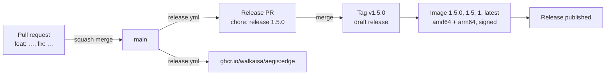

# Releasing

Releases are fully automated with [release-please](https://github.com/googleapis/release-please).
Nobody edits versions, writes tags or builds images by hand: merging a pull request is the only
thing a maintainer does.

## How it works



1. **Every change goes through a pull request** whose title follows
   [Conventional Commits](https://www.conventionalcommits.org). The PR title check enforces this;
   pull requests are squash-merged, so the title becomes the commit on `main`.
2. **Every push to `main`** runs CI and publishes the image as `edge`. release-please then opens
   or updates a single **release pull request** that contains the next version, all version bumps
   and the new `CHANGELOG.md` section.
3. **Merging the release pull request** releases: release-please creates the tag `vX.Y.Z` and a
   draft release. The workflow builds the image natively for `linux/amd64` and `linux/arm64`,
   signs its provenance and SBOM, pushes it with its version tags and only then publishes the
   release. If anything fails, the release stays a draft and no version tag moves.

## Which version comes next

release-please derives the version from the commits since the last release:

| Commit | Example | Next version |
| --- | --- | --- |
| `fix: …`, `perf: …`, `fix(deps): …` | `fix: keep the session after a password change` | patch: `1.4.2` → `1.4.3` |
| `feat: …` | `feat: sign in with passkeys` | minor: `1.4.2` → `1.5.0` |
| `feat!: …` or a `BREAKING CHANGE:` footer | `feat!: require AEGIS_ISSUER to use https` | major: `1.4.2` → `2.0.0` |
| `docs`, `refactor`, `test`, `build`, `ci`, `style`, `chore` | `ci: cache the pnpm store` | no release on their own |

A breaking change is anything an operator has to act on when upgrading: a removed or renamed
environment variable, a changed default, a dropped platform. New migrations alone are not breaking,
since they run automatically.

To release a specific version instead, add a `Release-As: 2.0.0` footer to a commit message. A
pre-release works the same way: `Release-As: 2.0.0-rc.1`.

## Image tags

| Tag | Moves | Published for |
| --- | --- | --- |
| `1.4.2` | never | exactly this release |
| `1.4` | with every patch release of 1.4 | the newest 1.4.x |
| `1` | with every minor and patch release of 1.x | the newest 1.x |
| `latest` | with every stable release | the newest stable release |
| `edge` | with every push to `main` | unreleased, for testing only |
| `sha-4d886fc` | never | the build of exactly this commit on `main` |

Moving tags only ever move forward. They are set after the build, based on the state at that
moment: `edge` only while its commit is still the newest on `main`, `latest`, `1` and `1.4` only
while the version is the newest stable one. A patch for an older line (`1.3.5` after `1.4.0`)
therefore never takes `latest` or `1` away from the newer release, and a run that finishes late
never moves a tag back to an older build. Pre-releases such as `2.0.0-rc.1` only get their exact
tag. Every image carries the commit, version and source in its OCI labels, together with signed
SLSA provenance and an SBOM.

## When something fails

- **A job failed in a release run**: open the run under Actions and use **Re-run failed jobs**. The
  release stays a draft until the image is published.
- **The run cannot be re-run** (for example because it is too old): open the **Release** workflow,
  choose **Run workflow**, select the tag (for example `v1.5.0`) under **Use workflow from** and
  start it. It builds that tag, refreshes its image tags and publishes the draft release.
- **A broken release was published**: never move, delete or reuse a tag. Merge a fix; the next
  patch release moves `latest`, `1` and `1.5` forward.

## One-time setup

### GitHub App for release-please

Pull requests created with the default `GITHUB_TOKEN` do not trigger other workflows, so the release
pull request would never get CI. release-please therefore uses a GitHub App token, which is short
lived, limited to this repository and not tied to a personal account.

1. **Settings → Developer settings → GitHub Apps → New GitHub App** on your account. Name it
   for example `Aegis Release`, disable the webhook and grant these repository permissions:
   **Contents: Read and write**, **Pull requests: Read and write**, **Issues: Read and write**
   (release-please labels its pull requests).
2. Generate a private key, then install the app on this repository only.
3. In this repository under **Settings → Secrets and variables → Actions**, add the variable
   `RELEASE_APP_CLIENT_ID` (the app's client ID) and the secret `RELEASE_APP_PRIVATE_KEY` (the full
   contents of the `.pem` file).

### Repository settings

- **General → Pull Requests**: allow only **squash merging** with the pull request title as the
  default commit message, and enable **Automatically delete head branches**.
- **General → Releases**: enable **Immutable releases**, so a published release and its tag can
  never be changed.
- **Actions → General**: set workflow permissions to **Read repository contents** (every workflow
  asks for more only where it needs it).
- **Rules → Rulesets**:
  - Branch `main`: require a pull request, require the status checks *Lint, types and build*,
    *Docker image* and *Conventional title*, block force pushes and deletion.
  - Tags `v*`: block updates and deletion. Restrict creation with the release app and repository
    admins as bypass actors, so only release-please (and the one-time 1.0.0 tag) creates versions.

### GHCR package

After the first image is pushed, open the package `aegis` under your profile → **Packages**, link
it to this repository if it is not linked yet, and set its visibility to **Public** once the
repository is public.

### Publishing 1.0.0

release-please takes over after the first release; 1.0.0 is published once by hand from its tag.
Until then, commits on `main` must not be `feat` or `fix`, otherwise release-please proposes a
version after 1.0.0 before 1.0.0 exists.

```bash
git switch main
git pull --ff-only
git tag -a v1.0.0 -m "Aegis 1.0.0"
git push origin v1.0.0
```

Then open **Actions → Release → Run workflow**, select the tag `v1.0.0` under **Use workflow from**
and run it. It checks the tag, runs CI, publishes the image as `1.0.0`, `1.0`, `1` and `latest` and
creates the release from the `CHANGELOG.md` section.
